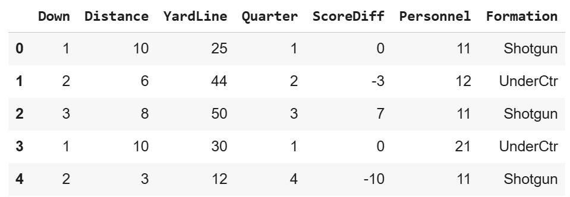
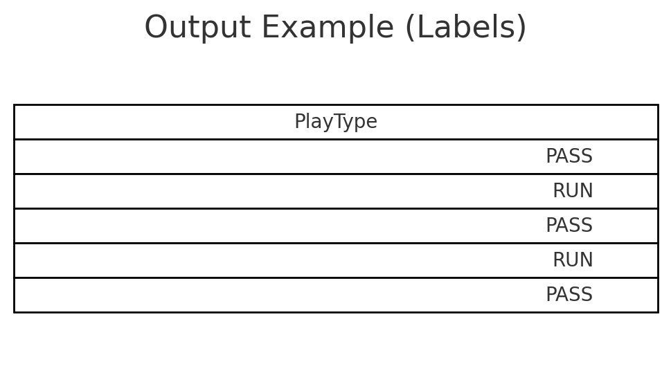

# NFL-Run-vs-Pass-Prediction-

## Overview

This project uses machine learning to predict whether an NFL offensive play will be a RUN or a PASS before the ball is snapped. It uses structured game information (down, distance, yard line, quarter, score differential, personnel, and formation) from NFL play-by-play data to explore how predictable offensive play-calling is. The repo is part of my UF DCP4300 project and is meant to demonstrate basic data setup, baseline modeling, and results sharing in a public GitHub repository.

### Authors

Michael Gomes  
[GitHub](https://github.com/michaelg133)

### Example Input and Output 

| Input                      | Output                    |
|----------------------------|---------------------------|
|  |  |
